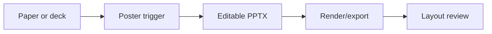

# Poster Skill

Portable academic-poster workflow skill with an editable PowerPoint-first source of truth and review checklist.

## Who This Is For

| Use this when you... | Use something else when you... |
| --- | --- |
| need to create, iterate, or review an academic poster | need a normal slide deck |
| want PowerPoint-first editable poster workflow | need only low-level .pptx XML repair |
| need density, layout, and presentation-readiness checks | only want to explain the paper without creating a poster |

## Why This Exists

- Keeps the editable poster as the source of truth.
- Pairs authoring workflow with review readiness.
- Prevents poster work from drifting into generic slide design.

## What Ships

| Component | Role |
| --- | --- |
| [`poster`](./poster) | installable Codex App skill package |
| [`poster/references`](./poster/references) | bundled public reference material |
| [`poster/scripts`](./poster/scripts) | bundled helper scripts |
| [`poster/test-prompts.json`](./poster/test-prompts.json) | trigger and non-trigger examples |
| [`CHANGELOG.md`](./CHANGELOG.md) | release history |
| [`LICENSE`](./LICENSE) | license |

## Install / Use

### Codex App

- Install the skill from this repo path: `poster`
- GitHub install target:
  - repo: `Mingdao007/poster-skill`
  - path: `poster`
- Restart `Codex App` after installation so the new skill is discovered.

## Workflow

## Coverage

- new, iterate, and review modes for academic poster work
- PowerPoint-first editable workflow with export and review guidance
- layout, density, and presentation-readiness checklist for poster sessions

## Expected Result / Verification

| Check | Expected result |
| --- | --- |
| Install target | `poster` |
| GitHub target | `Mingdao007/poster-skill` with path `poster` |
| Skill entrypoint | `poster/SKILL.md` exists |
| Trigger examples | `poster/test-prompts.json` |
| Privacy check | public package contains no private local paths or live user state |

## Trigger Examples

- `Build a poster from this paper.`
- `Iterate on my current poster .pptx.`
- `Review this poster layout for presentation readiness.`

## Non-Trigger Examples

- `Design a normal slide deck.`
- `Do low-level .pptx XML repair only.`
- `Explain the paper without creating a poster.`

## Privacy Boundary

This public repository keeps the workflow generic and reusable.

- Course-specific worked examples are excluded from the public package.
- The public version keeps only the generic poster rules and export helper.

## Repository Layout

| Path | Purpose |
| --- | --- |
| [`poster`](./poster) | installable Codex App skill package |
| [`poster/references`](./poster/references) | bundled public reference material |
| [`poster/scripts`](./poster/scripts) | bundled helper scripts |
| [`poster/test-prompts.json`](./poster/test-prompts.json) | trigger and non-trigger examples |
| [`CHANGELOG.md`](./CHANGELOG.md) | release history |
| [`LICENSE`](./LICENSE) | license |

Chinese:

- [README.zh-CN.md](./README.zh-CN.md)
